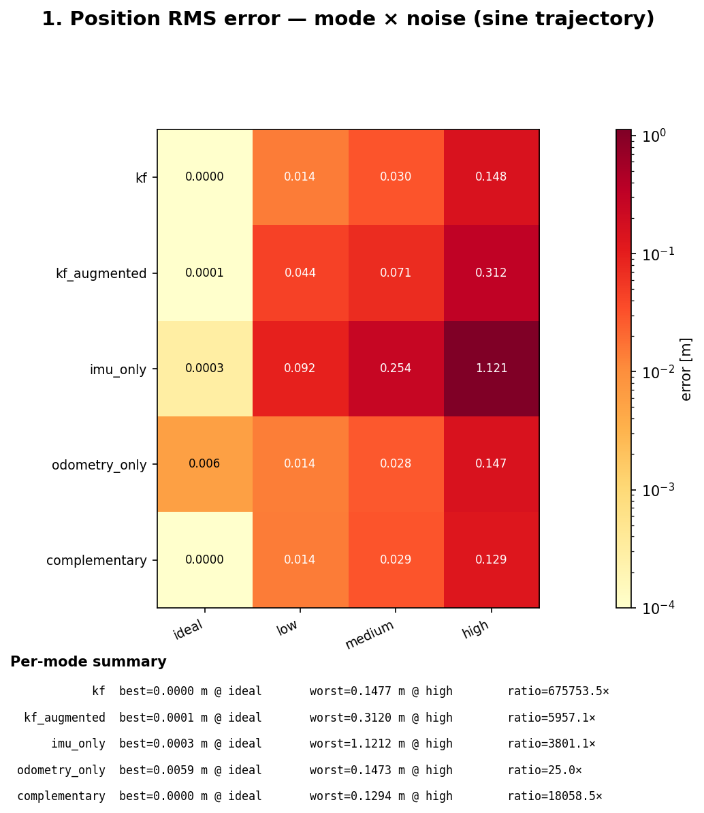
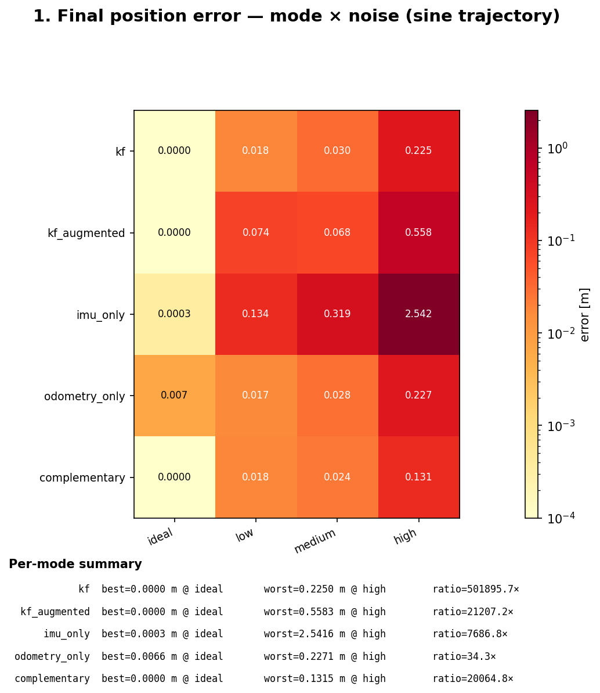
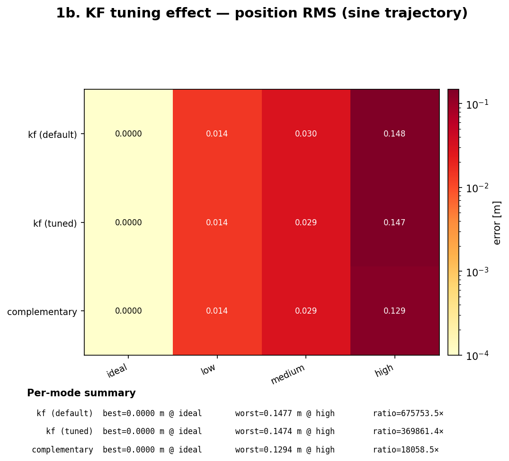
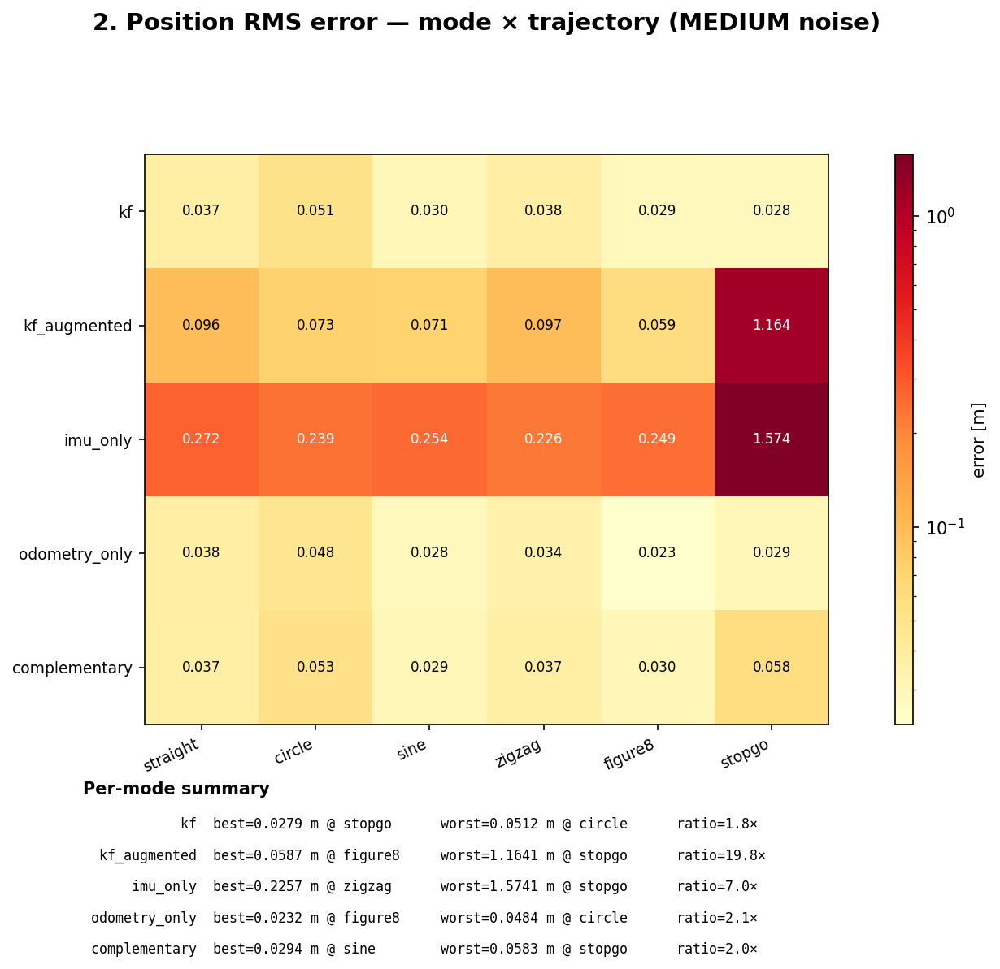
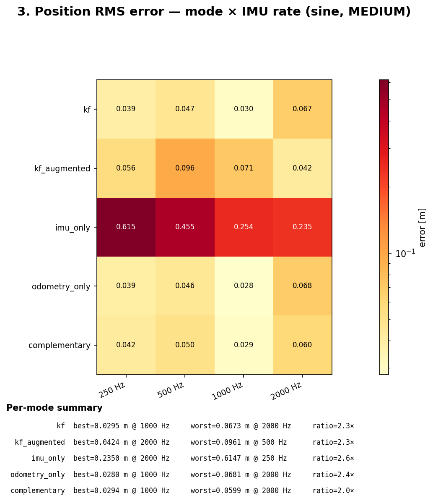
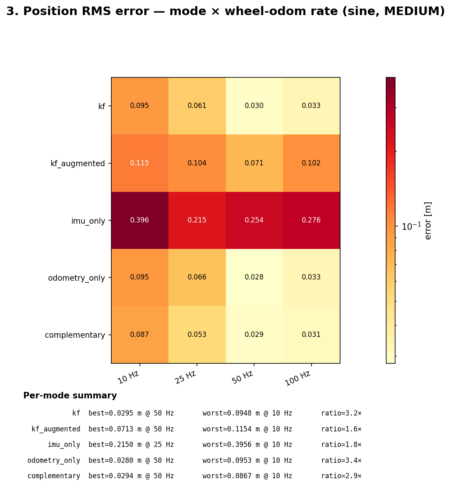
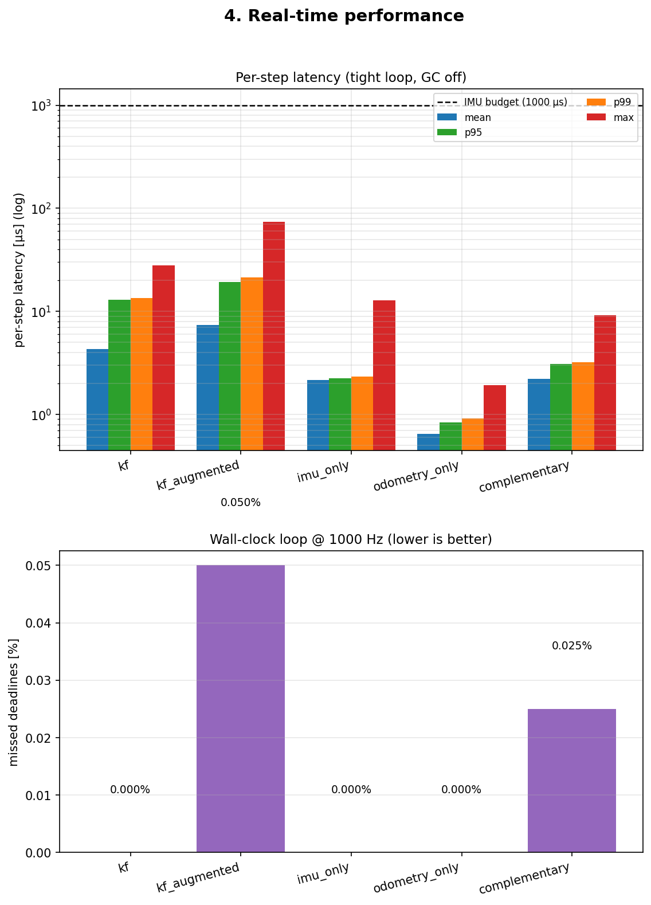

# Sensor Fusion Test Report

Generated: 2026-05-30T13:41:48

Tested fusion modes: `kf`, `kf_augmented`, `imu_only`, `odometry_only`, `complementary`

## 1. Noise-level sweep (sine trajectory)

Duration 8.0 s, IMU 1000 Hz, wheel 50 Hz, seed 7.

### Position RMS error [m]

| mode \ noise | ideal | low | medium | high |
|---|---|---|---|---|
| kf | 0.0000 | 0.0142 | 0.0295 | 0.1477 |
| kf_augmented | 0.0001 | 0.0439 | 0.0713 | 0.3120 |
| imu_only | 0.0003 | 0.0918 | 0.2543 | 1.1212 |
| odometry_only | 0.0059 | 0.0141 | 0.0280 | 0.1473 |
| complementary | 0.0000 | 0.0142 | 0.0294 | 0.1294 |

### Final position error [m]

| mode \ noise | ideal | low | medium | high |
|---|---|---|---|---|
| kf | 0.0000 | 0.0184 | 0.0301 | 0.2250 |
| kf_augmented | 0.0000 | 0.0744 | 0.0675 | 0.5583 |
| imu_only | 0.0003 | 0.1338 | 0.3188 | 2.5416 |
| odometry_only | 0.0066 | 0.0167 | 0.0282 | 0.2271 |
| complementary | 0.0000 | 0.0180 | 0.0242 | 0.1315 |

## 1b. KF tuning effect

The default `KalmanFusion2D` uses `FusionNoise(0.08, 0.01, 0.05)` regardless of the actual sensor noise — a hand-picked guess.  Below the KF is re-run with `FusionNoise` matched to each `NoiseLevel`'s real `ImuConfig` / `WheelOdomConfig`.  The tuned KF should at least match — and on noisy presets meaningfully beat — the constant-gain complementary filter.

### Position RMS error [m]

| variant \ noise | ideal | low | medium | high |
|---|---|---|---|---|
| kf (default) | 0.0000 | 0.0142 | 0.0295 | 0.1477 |
| kf (tuned) | 0.0000 | 0.0142 | 0.0295 | 0.1474 |
| complementary | 0.0000 | 0.0142 | 0.0294 | 0.1294 |

## 2. Trajectory sweep (MEDIUM noise)

### Position RMS error [m]

| mode \ trajectory | straight | circle | sine | zigzag | figure8 | stopgo |
|---|---|---|---|---|---|---|
| kf | 0.0372 | 0.0512 | 0.0295 | 0.0376 | 0.0285 | 0.0279 |
| kf_augmented | 0.0964 | 0.0730 | 0.0713 | 0.0971 | 0.0587 | 1.1641 |
| imu_only | 0.2716 | 0.2390 | 0.2543 | 0.2257 | 0.2486 | 1.5741 |
| odometry_only | 0.0376 | 0.0484 | 0.0280 | 0.0345 | 0.0232 | 0.0294 |
| complementary | 0.0373 | 0.0532 | 0.0294 | 0.0370 | 0.0300 | 0.0583 |

## 3. Frequency sweep (sine, MEDIUM noise)

### Position RMS error [m] vs IMU rate (wheel = 50 Hz)

| mode \ IMU Hz | 250.0 | 500.0 | 1000.0 | 2000.0 |
|---|---|---|---|---|
| kf | 0.0392 | 0.0467 | 0.0295 | 0.0673 |
| kf_augmented | 0.0556 | 0.0961 | 0.0713 | 0.0424 |
| imu_only | 0.6147 | 0.4552 | 0.2543 | 0.2350 |
| odometry_only | 0.0395 | 0.0458 | 0.0280 | 0.0681 |
| complementary | 0.0424 | 0.0504 | 0.0294 | 0.0599 |

### Position RMS error [m] vs wheel-odom rate (IMU = 1000 Hz)

| mode \ wheel Hz | 10.0 | 25.0 | 50.0 | 100.0 |
|---|---|---|---|---|
| kf | 0.0948 | 0.0609 | 0.0295 | 0.0332 |
| kf_augmented | 0.1154 | 0.1040 | 0.0713 | 0.1018 |
| imu_only | 0.3956 | 0.2150 | 0.2543 | 0.2757 |
| odometry_only | 0.0953 | 0.0657 | 0.0280 | 0.0334 |
| complementary | 0.0867 | 0.0533 | 0.0294 | 0.0312 |

## 4. Real-time performance

### Per-step latency (tight loop, GC disabled)

| mode | mean µs | p95 µs | p99 µs | max µs | budget µs | misses |
|---|---|---|---|---|---|---|
| kf | 4.34 | 12.96 | 13.46 | 28.12 | 1000 | 0 |
| kf_augmented | 7.35 | 19.25 | 21.33 | 74.33 | 1000 | 0 |
| imu_only | 2.17 | 2.25 | 2.33 | 12.83 | 1000 | 0 |
| odometry_only | 0.65 | 0.83 | 0.92 | 1.92 | 1000 | 0 |
| complementary | 2.20 | 3.08 | 3.21 | 9.17 | 1000 | 0 |

### Wall-clock real-time loop (busy-wait pacing)

| mode | duration s | achieved Hz | misses / N | miss rate ppm | max overshoot µs |
|---|---|---|---|---|---|
| kf | 4.00 | 1000.0 | 0/4000 | 0 | 0.0 |
| kf_augmented | 4.00 | 1000.0 | 2/4000 | 500 | 163.6 |
| imu_only | 4.00 | 1000.0 | 0/4000 | 0 | 0.0 |
| odometry_only | 4.00 | 1000.0 | 0/4000 | 0 | 0.0 |
| complementary | 4.00 | 1000.0 | 1/4000 | 250 | 330.6 |

## 5. Invariant checks

**23/23 checks passed.**

| status | check | detail |
|---|---|---|
| PASS | kf RMS ≤ 5 cm on sine+IDEAL | got 0.0000 m |
| PASS | kf_augmented RMS ≤ 5 cm on sine+IDEAL | got 0.0001 m |
| PASS | imu_only RMS ≤ 5 cm on sine+IDEAL | got 0.0003 m |
| PASS | odometry_only RMS ≤ 5 cm on sine+IDEAL | got 0.0059 m |
| PASS | complementary RMS ≤ 5 cm on sine+IDEAL | got 0.0000 m |
| PASS | kf beats imu_only by ≥5× on straight+HIGH | kf=0.1096 m  imu=0.8560 m  ratio=7.8× |
| PASS | kf beats imu_only by ≥5× on circle+HIGH | kf=0.0966 m  imu=0.6996 m  ratio=7.2× |
| PASS | kf beats imu_only by ≥5× on sine+HIGH | kf=0.1477 m  imu=1.1212 m  ratio=7.6× |
| PASS | kf beats imu_only by ≥5× on zigzag+HIGH | kf=0.1145 m  imu=0.7610 m  ratio=6.6× |
| PASS | kf beats imu_only by ≥5× on figure8+HIGH | kf=0.0540 m  imu=0.7742 m  ratio=14.3× |
| PASS | kf beats imu_only by ≥5× on stopgo+HIGH | kf=0.0461 m  imu=0.7982 m  ratio=17.3× |
| PASS | tuned kf ≤ default kf on sine+HIGH | tuned=0.1474 m  default=0.1477 m  improvement=+0.2% |
| PASS | kf RMS is monotonic in noise level on sine | 0.0000 ≤ 0.0142 ≤ 0.0295 ≤ 0.1477 |
| PASS | kf p99 latency < IMU budget (1000 Hz) | p99=13.46 µs  budget=1000 µs |
| PASS | kf_augmented p99 latency < IMU budget (1000 Hz) | p99=21.33 µs  budget=1000 µs |
| PASS | imu_only p99 latency < IMU budget (1000 Hz) | p99=2.33 µs  budget=1000 µs |
| PASS | odometry_only p99 latency < IMU budget (1000 Hz) | p99=0.92 µs  budget=1000 µs |
| PASS | complementary p99 latency < IMU budget (1000 Hz) | p99=3.21 µs  budget=1000 µs |
| PASS | kf wall-clock miss rate < 1 % | 0/4000 (0.000 %)  max_overshoot=0.0 µs |
| PASS | kf_augmented wall-clock miss rate < 1 % | 2/4000 (0.050 %)  max_overshoot=163.6 µs |
| PASS | imu_only wall-clock miss rate < 1 % | 0/4000 (0.000 %)  max_overshoot=0.0 µs |
| PASS | odometry_only wall-clock miss rate < 1 % | 0/4000 (0.000 %)  max_overshoot=0.0 µs |
| PASS | complementary wall-clock miss rate < 1 % | 1/4000 (0.025 %)  max_overshoot=330.6 µs |
